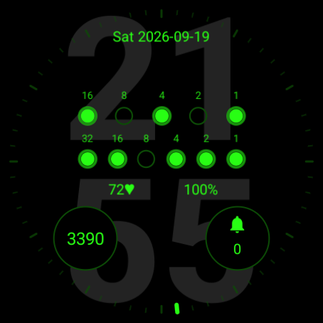
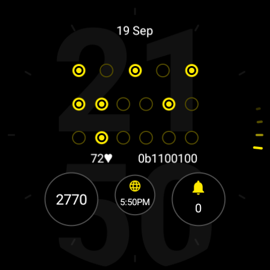
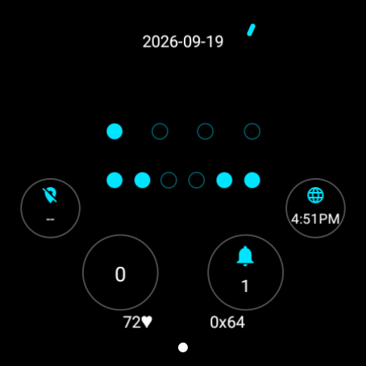

# Binary Watch Face

Binary Watch Face is a resource-only Wear OS face that presents hours, minutes, and optional seconds as true binary values. It is an independent implementation inspired by a retired face that no longer installs on newer watches.

<p align="center">
  
  
  
</p>

The leftmost dot in each row is the most significant bit. Add the weights above the lit dots to read the value. For example, `23` is `16 + 4 + 2 + 1`. Every row spans the same left and right endpoints while distributing its four, five, or six bits evenly between them.

## Features

- Offers direct 12- or 24-hour clock selection, defaulting to 24-hour mode
- Uses four hour bits in 12-hour mode, five in 24-hour mode, and six for minutes and seconds
- Offers optional full-dial decimal values, bit weights, a seconds row, multiple date formats, and decimal, hexadecimal, or binary watch-battery readouts
- Defaults dots and text independently to phosphor terminal green, with a broad palette and dark or light appearance
- Gives the decimal backdrop independent color, opacity, size, position, and active/AOD visibility controls
- Includes tiny through huge display sizes, none/glow/bezel dot effects, and none/single/wave/boost/all tick styles
- Provides two complications by default and configurable two-, three-, and four-slot layouts
- Preserves normal provider actions on complications without defining any whole-face or custom tap actions
- Uses dense patterned dots with configurable brightness and the selected color in always-on display mode by default, with optional decimal values, date, weekday, and watch battery while keeping complications legible

## Compatibility

The watch face uses Watch Face Format 5 and requires Wear OS 7, API level 37. Format 5 is required to let a setting enable exactly two, three, or four complication slots without leaving invisible tap targets. Compatibility depends on the installed OS rather than model age: Pixel Watch 2 is supported after updating to Wear OS 7, while watches that remain on earlier releases are not supported.

## Install

### Google Play closed beta

Use the same Google Account for both steps:

1. Join the self-service [Binary Watch Face Testers group](https://groups.google.com/g/binary-watch-face-testers).
2. [Opt in to the Google Play closed beta](https://play.google.com/apps/testing/dev.j256.binarywatchface).

After Google approves the beta release, Play provides installation and updates to group members who opt in. The group exists only to control beta access; only its owner can post, view conversations, or view the member list. See the [privacy policy](PRIVACY.md) for the membership disclosure.

### GitHub

Download `binary-watch-face.apk` and `binary-watch-face.apk.sha256` from the [GitHub releases](https://github.com/j-256/binary-watch-face/releases) page. Release APKs are exported from Google Play and carry the same app-signing certificate as Play-installed builds.

Verify the download:

```sh
shasum -a 256 -c binary-watch-face.apk.sha256
```

Install the latest [Android SDK Platform Tools](https://developer.android.com/tools/releases/platform-tools), then follow Google's [Wear OS debugging instructions](https://developer.android.com/training/wearables/get-started/debugging) to enable ADB debugging and connect the watch over USB or Wi-Fi. Install the APK directly on the watch:

```sh
adb install binary-watch-face.apk
```

Install later GitHub updates without clearing the watch-face configuration:

```sh
adb install -r binary-watch-face.apk
```

A locally built debug copy uses a different signing certificate. If ADB reports incompatible certificates, remove that copy before installing the release APK. Uninstalling clears its configuration:

```sh
adb uninstall dev.j256.binarywatchface
adb install binary-watch-face.apk
```

After installation, long-press the active watch face, scroll to **Add new**, and select **Binary**.

## Customize

Long-press the active face and choose **Edit**. Every choice names both the setting and selected value, such as **Dots: Terminal green** or **Seconds: Hidden**, and the package supplies a matching highlight overlay for editors that support it. Each enabled complication can be assigned through the normal Wear OS complication picker.

| Setting | Options |
| --- | --- |
| Dots color | Terminal green by default, plus white, warm colors, cool colors, greens, and grays |
| Text color | The same palette, selected independently and defaulting to terminal green |
| Theme | Dark by default or light |
| Backdrop color | The full palette, selected independently and defaulting to medium gray |
| Backdrop opacity | 5%, 10%, 15%, 30% by default, 50%, 75%, or 100% |
| Backdrop layout | Small, normal, or large at a raised, centered, or lowered position |
| Backdrop visibility | Active only by default, hidden, AOD only, or active and AOD |
| Size | Tiny, small, normal, large by default, or huge |
| Clock mode | 24-hour by default or 12-hour |
| Effect | None, glow by default, or bezel |
| Ticks | None, single, wave, boost, or all by default |
| Binary display | Optional seconds row and bit weights |
| Date | Nov 26, 11/26, 26 Nov, 26/11, 26.11, ISO, Unix timestamp, or hidden, with independent weekday and uppercase controls |
| Battery | Watch battery in decimal percent by default, hexadecimal, binary, or hidden |
| Complications | Two by default, three, or four |
| Always-on display | Dim, normal by default, or bright rendering; optional date, weekday, and watch-battery presets; and optional monochrome rendering |

The complication layouts keep the larger lower-left and lower-right providers stable when the count changes:

- Two: lower left and lower right
- Three: the lower pair plus a smaller lower center slot
- Four: the lower pair plus upper left and upper right

## Toolchain

The build requires JDK 17, Python 3, and the standalone [Android CLI](https://developer.android.com/tools/agents/android-cli). On macOS, `$HOME/Library/Android/sdk` is the standard SDK location. Install the project SDK packages with:

```sh
android --no-metrics sdk install platform-tools platforms/android-37.0 build-tools/36.0.0
```

Add the emulator and signed Wear OS 7 image for device testing:

```sh
android --no-metrics sdk install emulator system-images/android-37.0/android-wear-signed/arm64-v8a
```

Android CLI can start and manage an existing watch AVD, but its built-in `emulator create` command only accepts the hardware profiles shown by `--list-profiles`. Install the SDK command-line-tools component when a Wear profile is not listed, then create the AVD with `avdmanager`:

```sh
android --no-metrics sdk install cmdline-tools/latest
"$ANDROID_HOME/cmdline-tools/latest/bin/avdmanager" create avd \
    --name binary_watch_face_api_37 \
    --package 'system-images;android-37.0;android-wear-signed;arm64-v8a' \
    --device wearos_large_round
android --no-metrics emulator start --cold binary_watch_face_api_37
```

The SDK's `avdmanager` is used only for the Wear hardware profile. Package installation and emulator startup remain on Android CLI; the deprecated `sdkmanager` command is not needed.

## Build and install

Generate and build the resource-only APK and app bundle:

```sh
python3 tools/generate_watchface.py --check
./gradlew check assembleDebug bundleRelease
```

Install the debug APK without launching an activity:

```sh
android --no-metrics install \
    --device=emulator-5554 \
    --apks=watchface/build/outputs/apk/debug/watchface-debug.apk
```

On the watch, long-press the active face, scroll to **Add new**, and select **Binary**. The release app bundle is written beneath `watchface/build/outputs/bundle/release/`.

### Play release signing

Google Play App Signing owns the app-signing keys used on installed packages. Release bundles are signed locally with a separate, resettable upload key kept outside this repository. Set both signing variables to produce a signed upload bundle; leaving both unset preserves secret-free unsigned release builds for CI:

```sh
binary_watch_face_upload_password="$(security find-generic-password -a upload-keystore -s dev.j256.binarywatchface.upload -w)"
export BINARY_WATCH_FACE_UPLOAD_STORE_FILE=/absolute/path/to/upload-keystore.p12
export BINARY_WATCH_FACE_UPLOAD_PASSWORD="$binary_watch_face_upload_password"
./gradlew --no-configuration-cache bundleRelease
unset BINARY_WATCH_FACE_UPLOAD_STORE_FILE BINARY_WATCH_FACE_UPLOAD_PASSWORD binary_watch_face_upload_password
```

Verify the resulting upload bundle before submitting it to Play:

```sh
jarsigner -verify -verbose -certs watchface/build/outputs/bundle/release/watchface-release.aab
```

## Verification

Run the generator tests, generated-file check, and Android build with:

```sh
python3 -m unittest discover -s tests -v
python3 tools/generate_watchface.py --check
./gradlew check assembleDebug bundleRelease
```

Before publication, also run Google's [Watch Face Format validator and Memory Footprint Evaluator](https://github.com/google/watchface):

```sh
java -jar /path/to/wff-validator.jar 5 watchface/src/main/res/raw/watchface.xml
java -jar /path/to/memory-footprint.jar \
    --watch-face watchface/build/outputs/apk/debug/watchface-debug.apk \
    --schema-version 5 \
    --ambient-limit-mb 10 \
    --active-limit-mb 100 \
    --apply-v1-offload-limitations \
    --estimate-optimization
```

The GitHub Actions workflow repeats the deterministic generator checks and full Android build using Android CLI rather than `sdkmanager`.

## Privacy

The watch face contains no executable Android code, network access, analytics, or data-collection permissions. See [PRIVACY.md](PRIVACY.md).

## License

Copyright 2026 James Klein

Licensed under the GNU Affero General Public License, version 3 only. See [LICENSE](LICENSE).
