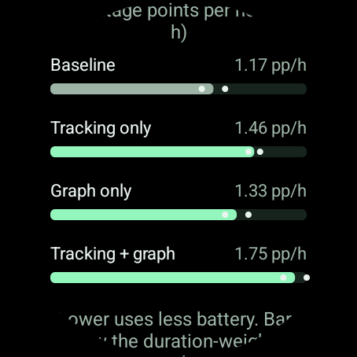
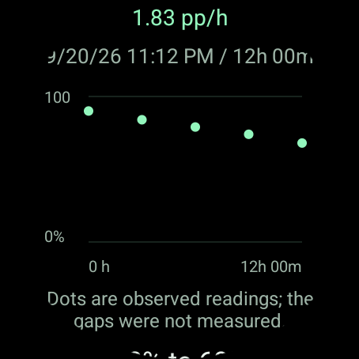

# Battery comparisons on the watch

Binary Heart History includes an optional battery diagnostic under **Settings > Battery test**. It compares whole-watch discharge in different recording and graph configurations. It does not measure isolated per-app energy, upload telemetry, or put heart-rate values in battery reports. The diagnostic is available in the ordinary app build so a Play-installed watch can use it without ADB.

For a step-by-step experiment, download the [standalone battery test plan](battery-test-plan.html) and open it in a browser. It compares Baseline, Tracking only, and Tracking + graph twice each, with a run schedule, repeatable checklist, and print layout. It works offline.

## Prepare a comparison

Use Binary Pulse throughout the experiment. Keep the same ordinary complications, brightness, always-on display, colors, decimal backdrop, graph contrast, time window, labels, connectivity, and usual routine. Use similar starting charge levels and avoid comparing a quiet day with a workout, software update, or unusually poor signal. Recordings made during tracking-off runs are not recoverable later.

| Mode | Recording | Watch-face Layout | Graph source |
| --- | --- | --- | --- |
| Baseline | Paused | Without heart history | None |
| Tracking only | On | Without heart history | None |
| Graph only | Paused | With heart history | Populated, invented preview |
| Tracking + graph | On | With heart history | Recorded readings |

The graph-only mode keeps rendering representative content at the provider's normal requested update cadence. Its invented trace has a different data-access path and shape from live history, so it is an approximation of graph cost. Comparing **Tracking + graph** against **Tracking only** estimates graph cost while using the recorder normally. Comparing **Tracking only** against **Baseline** estimates recording cost. Comparing **Tracking + graph** against **Baseline** estimates the combined difference; do not assume the individual costs add exactly.

1. Open **Binary Heart History > Settings > Battery test**, choose a mode, and tap **Set up mode**. Tracking modes require the permissions granted through **Start recording** in History settings.
2. Set Binary Pulse's **Layout** as instructed. Keep the same ordinary complication count when switching between graph and non-graph layouts. For a graph-on run, verify the graph is visible and its provider is assigned. The app cannot verify the face's layout automatically; the confirmation is your declaration of the setup.
3. Return to the battery test, confirm **Face layout matches this mode**, unplug the watch, and tap **Start run**. The combined mode also checks for recent recorded readings so an empty graph is not mistaken for its normal workload.
4. Close the app and wear the watch normally. Aim for comparable 12-24 hour runs. **Add battery reading** saves an optional intermediate checkpoint; avoid frequent checking because waking the screen itself uses power.
5. Before charging, tap **Finish run**. Confirm whether the watch stayed unplugged with the same face and settings, without force-stopping History. If it did not, choose **No, exclude**. The app saves the run and restores the previous recording/preview mode. It cannot restore the face's Layout; choose your usual layout afterward.
6. Repeat each mode on comparable days, varying the order to reduce day-to-day bias. Start with Baseline and Tracking + graph if you first want the overall difference, then use the other modes to separate the costs.

Setup, running, and pending restoration survive process death. If an operation fails or the app closes during a change, return to Battery test and retry setup or restoration. A recording or background-permission problem must be resolved before recording can resume. Cancelling setup restores the prior recording mode without creating a measured run. **Pause recording** in the ordinary settings also preserves eligible stored readings.

## Read the results

These screenshots use invented battery results on a disposable Wear OS emulator. They demonstrate the comparison and observation views, not measured battery impact.

| Mode comparison | Recorded observations |
| --- | --- |
|  |  |

The comparison chart uses a shared zero-based scale. Each bar is total battery percentage points lost divided by total elapsed hours for that mode; dots show the individual runs. A long run therefore contributes more than a short run. The displayed differences use percentage points per hour, abbreviated **pp/h**, rather than a percentage change relative to the baseline. Results remain preliminary until both compared modes have repeated eligible runs. Day-to-day variation and coarse battery gauges still limit attribution after repeats.

Only uninterrupted runs of at least twelve hours enter the chart. Comparisons are grouped by app version, watch model, OS build, graph time window, and label setting. Older or different configurations remain visible as individual runs. Other face settings and routine are controlled by the wearer, not automatically measured.

Open a saved run for its start/end levels, elapsed time, optional charge-counter rate, and a plot of its actual observations. The plot shows separate dots without connecting them into an invented discharge curve. It has no measurement between those points. Whole-percent battery readings are coarse; a small difference can be rounding or normal variation. Percentage comes from Android's [system battery status](https://developer.android.com/training/monitoring-device-state/battery-monitoring). A supported [charge counter](https://developer.android.com/reference/android/os/BatteryManager) supplies additional detail, not proof of greater accuracy.

Observed charging, rising gauges, reboot, app update, changed app settings, and recording errors exclude a run. A detected problem remains recorded even if the settings are changed back. The diagnostic uses monotonic elapsed time and the system boot count, so a wall-clock adjustment does not change the calculated duration and a reboot cannot silently appear to be a long trial. Start/end observations cannot reliably detect a brief intervening charge or a face change that was later undone; the finish confirmation is essential. Excluded and short runs remain inspectable but do not influence comparisons.

## Local data and export

The diagnostic adds no polling timer, alarm, background measurement job, foreground service, sensor subscription, or network permission. It reads battery information during explicit app interactions. Charging is also observed while the test screen is open. History recording, maintenance, and normal complication updates continue according to the selected mode. Paused recording cancels recorder jobs; expired readings are pruned on the next history read or recording operation.

Battery results have bounded local retention, with the limits defined in `BatteryTestStore` and displayed in the app. Cleanup happens when the results are opened. **Clear battery results** removes completed results and the app's cached export without erasing heart-rate history or cancelling the active run. Uninstalling the app removes both kinds of local data.

**Share results** creates a JSON file and opens the watch's system share chooser with temporary read access to that report only. A compatible receiving app must be installed; a phone destination is not guaranteed on every watch. Results and charts remain usable on the watch when sharing is unavailable. The app itself sends nothing over the network. Copies sent to another app are controlled by that recipient.

The versioned JSON contains trial IDs, declared modes, configuration groups, original recording modes for recovery, start/finish state, exclusion reasons, and individual battery observations. Each observation retains wall and monotonic timestamps in milliseconds, boot count, battery percent, optional charge in microampere-hours, plugged state, and app version. An unavailable numeric property uses `-1`. It contains no heart-rate readings, account identifiers, or device serial number. Keeping these observations supports independent recalculation, plots of individual runs, and comparisons without reducing the experiment to a single average.

## Verification

JVM tests cover drain arithmetic, elapsed versus wall time, charge-counter fallback, intermediate gauge increases, restart/update detection, short-run exclusion, bounded checkpoints, and duration-weighted comparisons. Disposable-emulator tests cover actual battery API reads, pause and restoration, persistence, invalidation, retention, scoped file export, and accessible graph rendering. Emulator battery levels exercise the logic and presentation only; they are not evidence of physical-watch battery impact.
