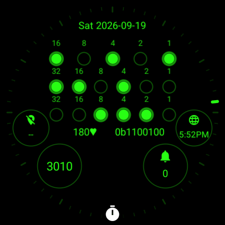
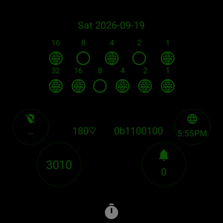

# Design considerations

Binary is a watch first. Its true-binary time display is the primary content; date, native readouts, complications, and perimeter ticks support that purpose. Use these constraints when changing the generator, editor highlights, or screenshots.

## Time remains the focus

Keep the binary rows horizontally centered and preserve their shared left and right endpoints. Complication count must not move or shrink the clock. The time rows retain their established vertical positions, including the layout that expands into the space available when seconds are hidden. Adjust supplemental information around the time before considering a change to the time itself.

Keep the decimal backdrop subordinate through its independent appearance controls. Readouts and complication labels should remain visually secondary to the binary field. Verify both a restrained preset and the largest clock with seconds and weights enabled; a layout that only works with small dots is insufficient.

The optional heart-history background follows the same hierarchy. Its wide, dim trace and faint area fill sit behind the clock, decimal backdrop, native readouts, and opaque complication backgrounds. Keep the trace's opacity uniform across the time window so edge fading cannot obscure its beginning or end. The fill may fade vertically beneath the trace. Hide labels by default and keep any optional caption above the bit weights. Retain stale and empty-data notices; identify invented readings in the companion app and review captions. Preserve the decimal backdrop's independent visibility and appearance controls when history is enabled: its numbers provide a quick alternative to reading binary. Hide the graph in AOD while honoring the selected decimal visibility. The image slot must remain outside the system-indicator reserve. Tapping exposed history content opens Binary Heart History for touch inspection and settings. Verify ordinary provider actions at every slot position whenever changing the overlapping background or its tap action. Static checks enforce foreground layer order and system clearance, but cannot prove touch routing. Graph visibility shares the Layout & brightness selector with provider count so Wear OS has only one setting controlling complication-slot enablement. See the [prototype guide](heart-rate-prototype.md) for rendered examples and the separate on-watch recorder.

Default Binary Pulse to the subtle history layout. Place the plot slightly below the image's vertical center to use the lower gap, while keeping the image bounds outside the system reserve and the side captions in their clock gutters. Keep the trace very faint, its optional time marks only slightly brighter, and the side timestamps brighter still while remaining subordinate to the clock and native readouts. Faint reduces the graph's opacity further; Clear increases it for users who need more contrast. Labels stay off by default; tapping the background provides timestamps and precise inspection in the companion app.

Optional time marks are vertical strokes centered on the heart-history trace, without a conventional axis or grid. Keep their orientation fixed as the trace rises and falls. Preserve gaps and use equal elapsed intervals so a wearer can count inward from the two side times. Control the marks separately from the side labels so the timestamps remain readable at native watch size. Keep the side times in the outer margins beside the hour row, clear of the moving bezel tick, round screen edge, and every provider layout. Only the optional range and status notices use the caption area beneath the date.

## System indicators own the bottom center

Wear OS draws a notification dot and a larger, tappable ongoing-activity indicator over the watch face. Stopwatch, timer, media, and workout activity can occupy more space than the dot. A dot-only screenshot does not establish clearance. See Google's [ongoing-activity documentation](https://developer.android.com/training/wearables/notifications/ongoing-activity).

Reserve a permanent bottom-center region for system indicators. Keep native readouts and complication tap targets outside that region with padding. Decorative ticks and the decimal backdrop may extend behind system UI, but no essential value may depend on that UI being absent. The reserved region is a project design constraint, not a universal Wear OS guarantee; device and OS changes require rendered verification.

On the 450-unit design canvas, reserve the union of a rectangle at `x=140..310`, `y=380..450` and a rounded rectangle at `x=140..310`, `y=366..450` with corner radius `38`. Maintain an additional four units of clearance from essential content and complication outlines. The rounded extension protects the taller stopwatch pill; the lower rectangle retains room beyond its curved sides. Device-specific pills can differ, so retain a physical-watch check when changing these regions.

A Pixel Watch 5 capture on 2026-09-19 measured an ambient stopwatch pill at approximately `x=150..300`, `y=368..441` after scaling its 480-pixel display to the design canvas. It overlapped the lower complications in the installed 0.2.0 layout. Both the active and ambient pill shapes fit the rounded reserve.

Installing 0.4.0 on the same watch verified the four-slot layout with Huge dots, visible weights, and seconds hidden in interactive and confirmed ambient modes. The lower complication outlines, including editor padding, retained approximately 12 pixels of clearance in active mode and 15 in ambient mode. The native readouts remained visible, the selected style and complication providers survived the update, and tapping the pill opened the running stopwatch. The optional center slot was checked geometrically against the captured shape; it was not enabled in that hardware configuration. Painted bounds do not establish the full system tap target or every animation frame.

Use named geometry in `tools/generate_watchface.py` and enforce separation in the generator tests. Check the full readout rectangles and complication ovals, including their editor outline padding. Do not replace these constraints with a small gap around the notification dot or a single default-preset screenshot.

## Readouts and complications

Heart rate and watch battery are native readouts, not complication slots. Place them together between the binary field and the lower complications, with heart rate on the left and battery on the right. Keep this row stable across complication counts and active/AOD modes. Preserve room for a three-digit heart rate, its heart glyph, and the longest binary battery value. Leave charging indication to Wear OS; the native battery readout only adds a low-battery cue.

The larger lower-left and lower-right complications retain their slot IDs, size, and position when the count changes. Smaller side complications flank the readout row in the four-slot layout. In the three-slot layout, the center complication sits below the readouts, between the lower pair. Preserve usable separation between circles, readable provider text, and visible perimeter ticks.

Native readouts must not look like labels belonging to unrelated complication providers. Complications retain their standard provider actions. The visible history background may open its own app through the image provider's tap action, while foreground complications and system indicators retain their actions. Do not add invisible complication targets or unrelated whole-face shortcuts. Keep editor highlights aligned with the actual content.

## History inspection

Binary Heart History opens to an enlarged chart with a Settings button. Keep the timestamp and BPM above the plot so the finger does not cover them. A vertical inspection line exists only during the active touch and clears on release, cancellation, loss of focus, or leaving the chart. Snap to recorded readings near the touched time; preserve missing-data gaps. The chart is cached during a gesture so dragging does not read storage or rebuild the image. Back from settings returns to the chart.

## Verification and release checkpoints

Geometry tests protect the reserved system region, readout separation, clock clearance, and complication separation. They complement rendered checks because glyphs, provider content, system overlays, and device scaling are not fully represented by simple bounds.

Follow the [layout verification guide](layout-verification.md) for repeatable clearance reports, physical-watch capture receipts, and before/after settings comparisons. The same geometry helpers serve the command and regression tests.

For a layout change, inspect active and always-on rendering for the following cases:

| Case | What to check |
| --- | --- |
| Zero complications | Minimal preset contains only the centered binary time and preserves the system reserve |
| Two complications | Clear hierarchy between time, native readouts, and the lower pair |
| Three complications | Center slot clears both readouts and neighboring complications |
| Four complications | Side slots clear the time at every size; lower slots remain balanced |
| Huge size, seconds, and weights | Time remains readable without collisions or a count-dependent shift |
| Binary battery, status cues, and three-digit heart rate | Full values and glyphs fit without touching providers |
| Notification dot and ongoing activity | Readouts remain visible and the system return action remains tappable |
| Dark, light, and AOD | Contrast, placement, and the system reserve remain valid |

The following Wear OS 7 emulator captures exercise the four-slot layout with Huge dots, seconds, bit weights, a three-digit sample heart rate, and a full binary battery value. The white or gray stopwatch icon is system UI supplied by an isolated ongoing-activity test app. The AOD capture retains the readouts while hiding the seconds row.

  
  

Before a release checkpoint, run the generator tests, generated-file consistency check, normal Gradle checks, and official WFF validator and memory evaluator. Preserve a versioned checkpoint before a substantial visual redesign so its behavior and artifacts remain available for comparison. A local version or tag does not publish to GitHub or change the Play testing track.
