# Heart-history prototype

Binary Pulse places a wide, quiet heart-rate history behind the binary time. It defaults to the subtle layout, with a very faint trace and a soft fill beneath it. The line keeps the same opacity across the time window, including its beginning and end. Labels are hidden by default, leaving timestamps in the app after a background tap. Optional time marks cross the trace, with start and end times at the sides and an optional BPM range beneath the date. Choose a 30-minute, 1-hour, 6-hour, or 24-hour window, and use the subtle graph or its higher-contrast clear alternative with any of the existing provider layouts. The clock stays centered, the native readouts remain legible, and the bottom system-indicator reserve remains clear.

This is a Wear OS 7 prototype distributed through private internal testing. **Binary Pulse** installs alongside **Binary**, and **Binary Heart History** is a separate on-watch application. The existing Binary installation does not need to be replaced.

## Preview

These Wear OS emulator captures use invented readings. They do not show anyone's health data. The companion app identifies preview mode; the watch face follows the selected label preference without a demo badge.

The decimal backdrop remains available above the graph, with full-dial numbers or compact HH:mm and independent appearance controls:

<p align="center">
  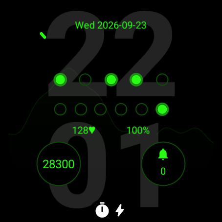
  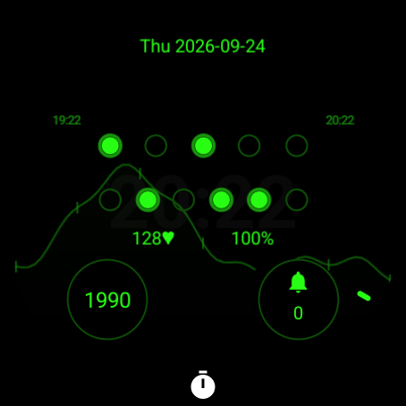
</p>

With the decimal backdrop hidden, these captures show the graph across its time windows:

<p align="center">
  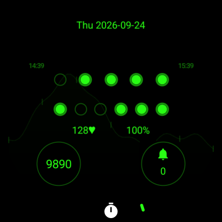
  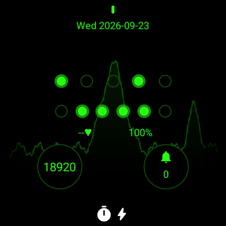
  
</p>

The [30-minute view](screenshots/history-half-hour.png) gives the closest look at short-term changes.

Light appearance uses the same image tinted to the selected text color. The largest clock keeps its bit weights clear of the graph caption. In confirmed AOD, the graph is hidden and the system's stopwatch indicator remains clear of the face content. The native heart-rate values in these layout fixtures are synthetic too.

<p align="center">
  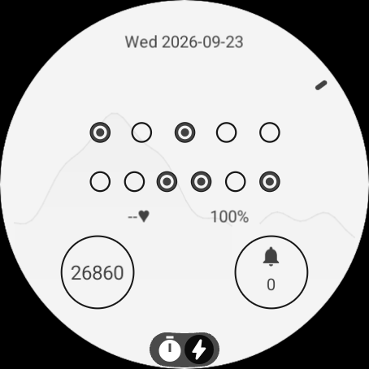
  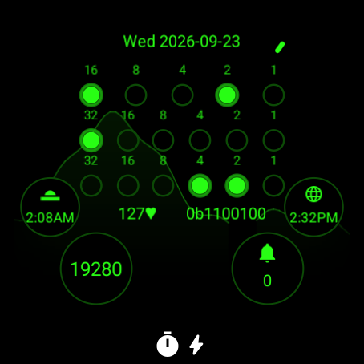
  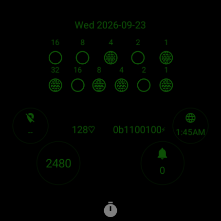
</p>

## Try it

### Install through Google Play without ADB

Check that the watch runs Wear OS 7 or newer. The maintainer must add the Google account used by the watch's Play Store to both apps' internal tester lists. The original Binary closed beta is a separate test and does not grant access to these packages.

1. Open each private test invitation with that Google account and choose **Become a tester**.
2. Follow the invitation's Google Play link and select the watch as the installation target. Install **Binary Heart History** first, then **Binary Pulse**.
3. Wait for both installations to finish on the watch, then follow [Configure the graph](#configure-the-graph).

Play can initially display the package names `dev.j256.binarywatchface.history (unreviewed)` and `dev.j256.binarywatchface.prototype (unreviewed)`. A newly published internal test can take time to become installable. If an invitation reports that the app is unavailable, confirm the selected account matches the tester list before retrying. See Google's [internal testing guide](https://support.google.com/googleplay/android-developer/answer/9845334?hl=en).

A debug APK and a Play-installed app use different signing certificates. If either prototype was previously installed from a debug APK, remove that prototype before switching to Play. Uninstalling Binary Heart History erases its local readings; uninstalling Binary Pulse resets its face settings.

### Build and install with ADB

Use the [repository toolchain](../README.md#toolchain), including JDK 17 and Android API 37, to build both APKs:

```sh
python3 tools/generate_watchface.py --check
./gradlew check :history:assembleDebug :watchface:assemblePrototype
```

For a physical watch, check that it runs Wear OS 7 (Android API 37) before installing. Put the watch and computer on the same Wi-Fi network, enable the watch's developer options, then enable **ADB debugging** and **Wireless debugging**. Choose **Pair new device**, use the IP address and pairing port shown there, and enter its pairing code when prompted. Return to the main Wireless debugging screen for the connection address; its port can differ from the pairing port. These steps follow Android's [Wi-Fi debugging guide](https://developer.android.com/training/wearables/get-started/debug-wifi).

```sh
adb pair WATCH_IP:PAIRING_PORT
adb connect WATCH_IP:CONNECTION_PORT
adb devices -l
```

Use the connected device's exact serial from `adb devices -l` in place of `DEVICE_SERIAL` below. Confirm its API level, then install the history app before the face so its provider is available during setup. The same installation commands work with an explicitly selected Wear OS 7 emulator.

```sh
adb -s DEVICE_SERIAL shell getprop ro.build.version.sdk
adb -s DEVICE_SERIAL install -r history/build/outputs/apk/debug/history-debug.apk
adb -s DEVICE_SERIAL install -r watchface/build/outputs/apk/prototype/watchface-prototype.apk
```

The SDK check must report `37` or newer. In the downloadable prototype bundle, the corresponding APKs are named `binary-heart-history.apk` and `binary-pulse-prototype.apk`. When updating the prototype, install both APKs together so the face and its graph provider use matching styles.

### Configure the graph

1. Open **Binary Heart History** from the watch's app list, then tap **Settings** below the graph.
2. Choose **Preview sample data** for an immediate demonstration, or **Start recording** and grant heart-rate access followed by background access.
3. Choose the time window in the app. It applies to both the preview and watch-face graph.
4. Under **Graph labels**, keep **None** for the default minimal face, or choose **Time marks** or **Time + range**. Time marks sit directly on the trace; the small side captions give the window's start and end in local 24-hour time. The app explains the spacing for the selected window. This setting changes the face; the app's chart keeps its labels.
5. Long-press the watch face, choose **Add new**, and select **Binary Pulse**. Its default layout enables the subtle graph and two ordinary providers.
6. In the face editor, use **Layout** to select subtle or clear heart history with no ordinary providers, or with two, three, or four. If automatic provider selection is unavailable, assign **Heart history graph** to **Heart history background** in the complication picker.

Updating an existing installation preserves its chosen layout. To use the quieter default on that installation, select **Layout: Two slots + heart history, subtle**, or the subtle option for your preferred provider count. Keep **Graph labels: None** in Binary Heart History to show timestamps only in the app. The decimal backdrop defaults to active mode and retains its own color, opacity, layout, and visibility controls. An installation that already has the backdrop hidden keeps that choice after an update; select **Backdrop visibility: Active only** or **Active and AOD** to show the numbers with the graph.

Wear OS allows only one active setting to control complication-slot enablement. Graph visibility and provider count therefore share the Layout selector. Choosing a layout without history disables the image slot completely. Use the supplied **Heart history graph** provider. Tapping an exposed part of its background opens Binary Heart History; ordinary complications retain their own actions. The graph renders below the ordinary complications, whose opaque backgrounds preserve their contrast and whose normal actions remain reachable.

The graph's window and annotation preferences belong to the history app and add no WFF settings. The face shares its existing Layout choices because the [WFF configuration schema](https://github.com/google/watchface/blob/main/third_party/wff/specification/documents/5/userConfiguration/userConfigurationsElement.xsd) permits at most twenty top-level entries, including the presets container. Generator tests enforce this limit.

Recording starts with an empty history and fills as the watch delivers readings. It does not import an existing fitness app's history. **Pause recording** and preview preserve eligible recorded data; **Start recording** resumes collection. **Stop and erase history** clears it after confirmation. The decimal backdrop renders above the history graph, and its visibility stays independent of the selected history layout.

**Settings > Battery test** compares battery drain with recording and the background graph independently enabled or disabled. It includes guided setup, preserved recording preferences, local results, comparison charts, and a battery-only JSON export. Follow the [battery comparison guide](battery-testing.md) for matched runs and the limitations of whole-watch measurements.

The time-window controls are under **Settings** in the on-watch app. Turn the crown or swipe to scroll Settings, battery-test screens, and their dialogs. Button labels are centered with space on both sides, including the compact time-window choices.

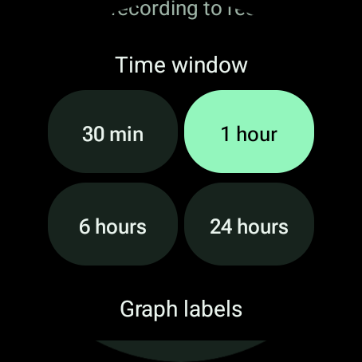

## Touch inspection

Tap the exposed history background on the active face to open Binary Heart History. The app opens to a larger graph; tap **Settings** for recording, time windows, and face labels. The ordinary complications keep their provider actions, and the bottom system indicator keeps its return action. A layout without history has no graph shortcut.

Hold a finger on the app's plot and drag horizontally. A vertical line and point mark the selected reading while its local timestamp and BPM appear above the graph. Lift your finger to dismiss them. The cursor also clears if the gesture is cancelled or the chart loses focus. **View graph** or the system Back gesture returns from settings to the chart.

Inspection shows the original recorded timestamp and value, even when the overview combines readings into display buckets. It snaps to the nearest reading within one minute of the touched time; farther from recorded data it shows the touched time and **No reading**. It does not interpolate heart-rate values across gaps. Times include seconds and the weekday, so a day-long view remains unambiguous across midnight.

<p align="center">
  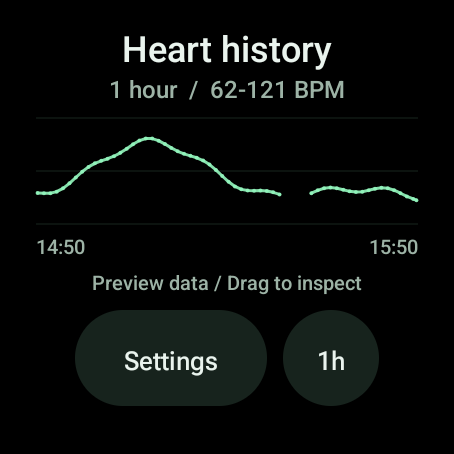
  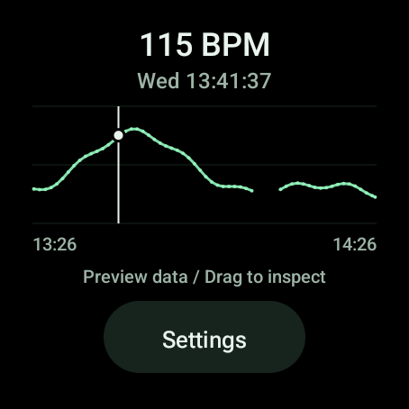
  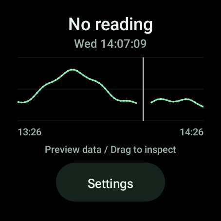
</p>

## Preview data

The preview is a deterministic synthetic day with one reading per minute. It combines small resting fluctuations, a lower sleep period, a walking peak, and a stronger exercise peak, spanning approximately 45 to 163 BPM across the full day. Two deliberate interruptions leave five and thirty-two minutes between consecutive readings. This exercises interrupted collection as well as continuous segments.

Every refresh regenerates the same shape relative to the new end time. Its timestamps advance, but the preview does not evolve or scroll through different activity. It is a visual fixture, not a continuous sensor simulation. Real recording stores incoming readings and advances the rolling window over that history.

The shorter windows show less of the fixture: thirty minutes covers modest variation, one hour includes the walking peak, six hours adds the exercise peak, and twenty-four hours includes the lower sleep period. The renderer groups readings into display buckets and preserves each bucket's minimum and maximum. At the day scale, the short interruption falls inside a bucket and can disappear; the longer interruption remains visible. Separate tests exercise empty, stale, invalid, isolated, and out-of-order readings.

## How the graph behaves

| Choice | Behavior |
| --- | --- |
| Window | Rolling 30 minutes, 1 hour, 6 hours, or 24 hours, ending at image generation |
| Contrast | Subtle by default in Binary Pulse; Clear increases the graph's opacity through the face's Layout setting |
| Labels | None by default; optionally show marks on the trace and side times, with or without the observed BPM range |
| Refresh | Requests Wear OS updates about every five minutes; explicit setting changes request an immediate refresh |
| Trace | Dim bucket averages with a faint min/max envelope to retain short peaks and a soft fill beneath each connected segment |
| Missing data | Breaks both the trace and its fill when adjacent readings are more than two minutes apart; gaps shorter than a display bucket can disappear at long spans |
| Scale | Adjusts to the visible range with padding; the optional range caption gives the observed minimum and maximum in BPM |
| Age | The range caption includes the newest reading's age; a stale notice appears after fifteen minutes even when labels are hidden |
| Always-on display | Hides the graph to preserve the established low-activity clock presentation |
| No data | Displays a waiting or setup prompt rather than invented readings |

This is a periodically refreshed trend, not a beat-to-beat pulse or ECG waveform. Sensor cadence, batching, and availability belong to the device's Health Services implementation. The native heart-rate readout and this stored history can update at different times. A graph image expires after ten minutes if it is not refreshed. See Android's [passive monitoring guide](https://developer.android.com/health-and-fitness/health-services/monitor-background) and [complication update guidance](https://developer.android.com/training/wearables/complications/exposing-data).

The on-watch app keeps a brighter chart with guide lines and touch inspection. The watch-face image uses the wider, dimmer treatment. Charging status is left to Wear OS's system indicator.

Hiding labels leaves fresh history entirely free of captions in both preview and recording modes. Stale or empty histories retain their status notices. See the [optional time and range captions](screenshots/history-labels.png) for the more detailed treatment.

### Reading the time marks

Vertical strokes mark the trace at equal elapsed intervals. The trace is very faint, the strokes are slightly brighter, and the side timestamps are brighter still. All three remain dimmer than the primary time and readouts. Each stroke stays upright and centered on the trace as it rises and falls. Count inward from the start or end time using the spacing below. Marks are omitted where there is no connected trace; the clock and complication content can cover portions of the background. The side times describe the full selected window, even when recorded history fills only part of it. They advance when the graph image refreshes.

| Window | Time between marks |
| --- | --- |
| 30 minutes | 5 minutes |
| 1 hour | 10 minutes |
| 6 hours | 1 hour |
| 24 hours | 4 hours |

Weekdays accompany the side times when the window crosses midnight. Times use the watch's local timezone; mark spacing remains elapsed time across daylight-saving changes. The captions sit in the outer margins beside the hour row so the four-slot layout cannot cover them. There is no on-face demo badge.

<p align="center">
  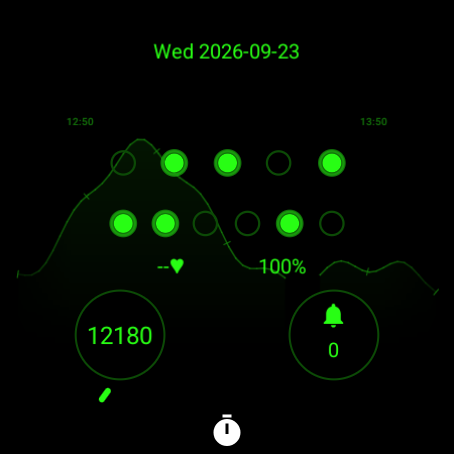
</p>

<p align="center">
  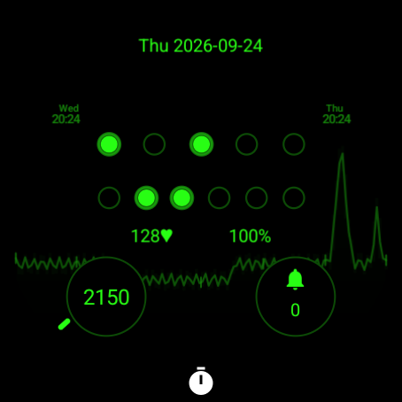
  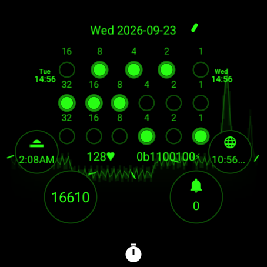
</p>

The clear layout raises the graph's contrast. Light appearance retains the subtle treatment by default:

<p align="center">
  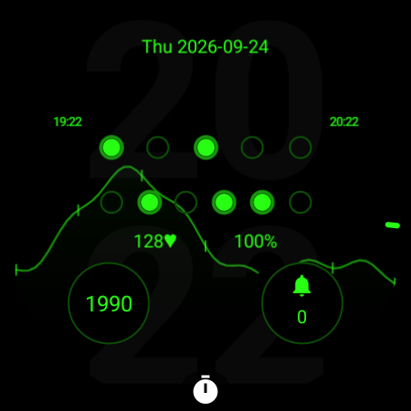
  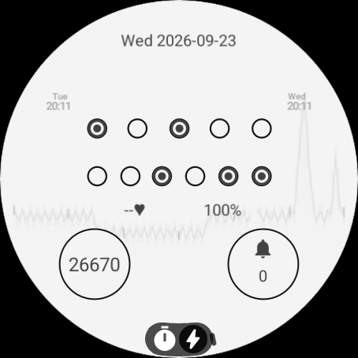
</p>

## Architecture and privacy

The `watchface` module remains resource-only with `android:hasCode="false"`. Watch Face Format exposes a scalar heart rate but does not provide a history buffer for this graph. The separate `history` app receives passive Health Services callbacks, stores a bounded local series, and renders a transparent image complication. WFF draws that image below the binary clock and tints it to the selected text color. See the [WFF data-source reference](https://developer.android.com/reference/wear-os/wff/common/attributes/source-type).

The recorder uses the Wear OS health permissions for heart-rate and background access, requested separately. It checks passive heart-rate capability before registering and schedules recovery after reboot or package replacement. A short, bounded registration attempt runs off the UI and image-delivery thread. Unsupported devices and registration failures have visible status messages. See the [Health Services permission guide](https://developer.android.com/health-and-fitness/health-services/permissions).

Readings stay in private app storage. Values outside the supported input range of 25 to 240 BPM, invalid numbers, future timestamps, and sensor readings marked unreliable or no-contact are excluded. Storage retains at most one value per second, keeping the newest reading when batches arrive out of order. Collection, reads, and background maintenance prune data outside the preceding 24 hours. The app requests no network access and disables backup. Logs report operation, outcome, duration, and sample count without recording health values. See the [privacy policy](../PRIVACY.md), including system image caching and delayed maintenance when the app is stopped.

## Verification

Run the ordinary generator, geometry, lint, JVM, and build checks:

```sh
python3 -m unittest discover -s tests -v
python3 tools/generate_watchface.py --check
python3 tools/check_layout.py
./gradlew check assembleDebug bundleRelease :watchface:assemblePrototype
```

Run database and lifecycle integration tests on a disposable emulator. These tests erase the history app's data:

```sh
ANDROID_SERIAL=EMULATOR_SERIAL ./gradlew :history:connectedDebugAndroidTest
```

The prototype has been checked on a Wear OS 7 emulator for Health Services callback delivery with emulated sensor values, the separate permission prompts, reboot registration, sample-window updates, and active/AOD rendering. Actionable world-clock providers at every ordinary slot position verified that the overlapping background leaves their actions reachable. Tapping the system stopwatch indicator opened the ongoing activity. Storage tests cover expiration, out-of-order batches, unreliable values, late callbacks after stopping, permission-loss handling, and sample isolation. Image tests check payload size, transparent edges, unfilled gaps, and side-label clearance. Touch tests cover dragging and clearing the cursor on release, cancellation, visibility changes, and focus loss. Inspection tests cover original timestamps and values, out-of-order readings, empty history, and missing intervals. Timeline tests cover elapsed spacing, trace interpolation, missing and partial history, local time, and daylight-saving changes. Layout checks cover foreground layer order, readouts, ordinary provider targets, and the ongoing-activity reserve. Official WFF validation and memory evaluation complement these checks; see the [verification guide](layout-verification.md).

On 2026-09-23, the wearer confirmed installing both apps through private Play testing on a Pixel Watch 5, granting heart-rate and background access, adding Binary Pulse as a watch face, and seeing recorded readings in both the app and the face after selecting the graph provider. Long-duration reliability, battery impact, and manufacturer-specific sensor cadence remain unverified on hardware. Private Play internal testing enables on-wrist evaluation; it does not establish public release readiness. On-wrist testing and health-permission distribution requirements need review before wider publication.

## Prepare a private Play update

Use separate Play applications for `dev.j256.binarywatchface.history` and `dev.j256.binarywatchface.prototype`, each with the Wear OS form factor and a Wear OS-only internal testing track. Keep their tester lists explicit. These packages must not be uploaded to the original Binary application. Google's [Wear OS publishing guide](https://developer.android.com/training/wearables/watch-face-designer/publish) covers form-factor and internal-track setup.

Set the upload-key environment variables using the [signing instructions](../README.md#play-release-signing), then build the two upload bundles with configuration caching disabled:

```sh
./gradlew --no-configuration-cache check :history:bundleRelease :watchface:bundlePrototypeRelease
```

Upload `history/build/outputs/bundle/release/history-release.aab` to Binary Heart History and `watchface/build/outputs/bundle/prototypeRelease/watchface-prototypeRelease.aab` to Binary Pulse. The `prototypeRelease` variant shares the prototype face resources while remaining non-debuggable and resource-only. Both bundles use the configured upload key; leaving both signing variables unset produces unsigned bundles for local checks.

Before uploading, verify each bundle's signature, package, version, and checksum, and run the official WFF validator and memory evaluator for the face. Check each app's highest uploaded version code before building an update, and increase its code because Play does not accept a reused code. Binary Pulse uses `prototypeVersionCode` and `prototypeVersionNameSuffix` in `watchface/build.gradle.kts` independently of Binary's version. Review the internal track, tester audience, and release notes before publishing. Confirm availability in Play separately from upload completion and separately from installation on the watch.

## Remove the prototype

Select the original Binary face, then uninstall **Binary Pulse** and **Binary Heart History** through the watch's app settings or Play Store. For an ADB installation, the equivalent commands are:

```sh
adb -s DEVICE_SERIAL uninstall dev.j256.binarywatchface.prototype
adb -s DEVICE_SERIAL uninstall dev.j256.binarywatchface.history
```

This removes the prototype face settings and local heart-rate history. It leaves the original Binary package installed.
